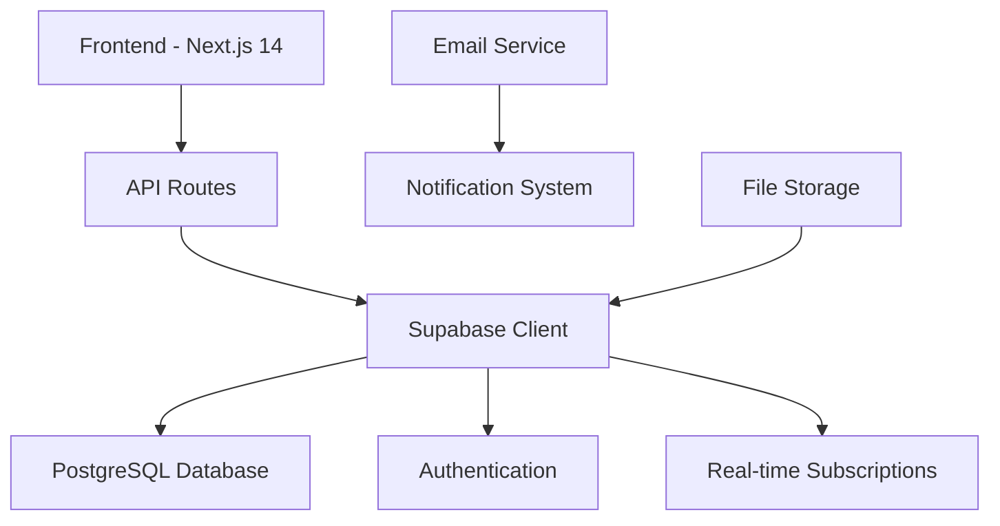

# Design Document - Sistema de Gestão de Oportunidades

## Overview

O Sistema de Gestão de Oportunidades será desenvolvido como uma aplicação web moderna usando Next.js 14 com TypeScript, seguindo uma arquitetura modular e escalável. A solução utilizará Supabase como backend-as-a-service para autenticação, banco de dados PostgreSQL e real-time subscriptions.

## Architecture

### High-Level Architecture



### Technology Stack

**Frontend:**
- Next.js 14 (App Router)
- TypeScript
- Tailwind CSS
- Shadcn/ui Components
- React Hook Form + Zod
- Tanstack Query (React Query)
- Zustand (State Management)

**Backend:**
- Supabase (BaaS)
- PostgreSQL Database
- Row Level Security (RLS)
- Edge Functions (quando necessário)

**Additional Services:**
- Resend (Email notifications)
- Vercel (Deployment)

## Components and Interfaces

### Core Modules Structure

```
src/
├── app/
│   ├── (dashboard)/
│   │   ├── dashboard/
│   │   ├── clientes/
│   │   ├── fornecedores/
│   │   ├── oportunidades/
│   │   └── layout.tsx
│   ├── auth/
│   └── api/
├── components/
│   ├── ui/ (shadcn components)
│   ├── dashboard/
│   ├── clientes/
│   ├── fornecedores/
│   ├── oportunidades/
│   └── shared/
├── lib/
│   ├── supabase/
│   ├── validations/
│   ├── utils/
│   └── types/
└── hooks/
```

### Key Components

#### 1. Dashboard Components
- `DashboardOverview` - KPIs e métricas principais
- `SalesChart` - Gráfico de funil de vendas
- `PerformanceChart` - Desempenho por vendedor
- `RecentActivities` - Lista de atividades recentes
- `UpcomingDeadlines` - Oportunidades próximas do vencimento

#### 2. Oportunidades Components
- `OpportunityKanban` - Visualização Kanban drag-and-drop
- `OpportunityList` - Visualização em lista com filtros
- `OpportunityForm` - Formulário de criação/edição
- `OpportunityDetails` - Visualização detalhada
- `ActivityTimeline` - Histórico de atividades

#### 3. Shared Components
- `DataTable` - Tabela reutilizável com paginação e filtros
- `SearchInput` - Campo de busca com debounce
- `StatusBadge` - Badge de status customizável
- `DatePicker` - Seletor de datas
- `NotificationCenter` - Centro de notificações

## Data Models

### Database Schema

```sql
-- Tabela de usuários (extends Supabase auth.users)
CREATE TABLE profiles (
  id UUID REFERENCES auth.users PRIMARY KEY,
  full_name TEXT NOT NULL,
  email TEXT NOT NULL,
  role TEXT NOT NULL CHECK (role IN ('vendedor', 'gerente', 'diretor')),
  team_id UUID,
  created_at TIMESTAMP WITH TIME ZONE DEFAULT NOW(),
  updated_at TIMESTAMP WITH TIME ZONE DEFAULT NOW()
);

-- Tabela de clientes
CREATE TABLE clientes (
  id UUID PRIMARY KEY DEFAULT gen_random_uuid(),
  nome_razao_social TEXT NOT NULL,
  cnpj_cpf TEXT UNIQUE,
  nome_contato TEXT NOT NULL,
  email_contato TEXT NOT NULL,
  telefone TEXT,
  endereco_completo TEXT,
  status TEXT NOT NULL DEFAULT 'prospect' CHECK (status IN ('ativo', 'prospect', 'inativo')),
  created_by UUID REFERENCES profiles(id),
  created_at TIMESTAMP WITH TIME ZONE DEFAULT NOW(),
  updated_at TIMESTAMP WITH TIME ZONE DEFAULT NOW()
);

-- Tabela de fornecedores
CREATE TABLE fornecedores (
  id UUID PRIMARY KEY DEFAULT gen_random_uuid(),
  nome_razao_social TEXT NOT NULL,
  cnpj TEXT UNIQUE NOT NULL,
  contato_principal_nome TEXT NOT NULL,
  contato_principal_email TEXT NOT NULL,
  contato_principal_telefone TEXT,
  area_atuacao TEXT,
  observacoes TEXT,
  status TEXT NOT NULL DEFAULT 'ativo' CHECK (status IN ('ativo', 'inativo')),
  created_by UUID REFERENCES profiles(id),
  created_at TIMESTAMP WITH TIME ZONE DEFAULT NOW(),
  updated_at TIMESTAMP WITH TIME ZONE DEFAULT NOW()
);

-- Tabela de oportunidades
CREATE TABLE oportunidades (
  id UUID PRIMARY KEY DEFAULT gen_random_uuid(),
  titulo TEXT NOT NULL,
  cliente_id UUID NOT NULL REFERENCES clientes(id),
  valor_estimado DECIMAL(15,2) NOT NULL,
  fase TEXT NOT NULL DEFAULT 'qualificacao' CHECK (fase IN ('qualificacao', 'proposta', 'negociacao', 'ganha', 'perdida')),
  data_fechamento_prevista DATE NOT NULL,
  responsavel_id UUID NOT NULL REFERENCES profiles(id),
  probabilidade_fechamento INTEGER CHECK (probabilidade_fechamento >= 0 AND probabilidade_fechamento <= 100),
  descricao TEXT,
  created_by UUID REFERENCES profiles(id),
  created_at TIMESTAMP WITH TIME ZONE DEFAULT NOW(),
  updated_at TIMESTAMP WITH TIME ZONE DEFAULT NOW()
);

-- Tabela de associação oportunidade-fornecedor (many-to-many)
CREATE TABLE oportunidade_fornecedores (
  id UUID PRIMARY KEY DEFAULT gen_random_uuid(),
  oportunidade_id UUID NOT NULL REFERENCES oportunidades(id) ON DELETE CASCADE,
  fornecedor_id UUID NOT NULL REFERENCES fornecedores(id),
  created_at TIMESTAMP WITH TIME ZONE DEFAULT NOW(),
  UNIQUE(oportunidade_id, fornecedor_id)
);

-- Tabela de atividades/histórico
CREATE TABLE atividades (
  id UUID PRIMARY KEY DEFAULT gen_random_uuid(),
  oportunidade_id UUID NOT NULL REFERENCES oportunidades(id) ON DELETE CASCADE,
  tipo TEXT NOT NULL CHECK (tipo IN ('nota', 'ligacao', 'email', 'reuniao', 'proposta', 'mudanca_fase', 'sistema')),
  titulo TEXT NOT NULL,
  descricao TEXT,
  usuario_id UUID NOT NULL REFERENCES profiles(id),
  created_at TIMESTAMP WITH TIME ZONE DEFAULT NOW()
);

-- Tabela de notificações
CREATE TABLE notificacoes (
  id UUID PRIMARY KEY DEFAULT gen_random_uuid(),
  usuario_id UUID NOT NULL REFERENCES profiles(id),
  oportunidade_id UUID REFERENCES oportunidades(id),
  tipo TEXT NOT NULL CHECK (tipo IN ('vencimento_proximo', 'vencimento_vencido', 'mudanca_fase')),
  titulo TEXT NOT NULL,
  mensagem TEXT NOT NULL,
  lida BOOLEAN DEFAULT FALSE,
  enviada_email BOOLEAN DEFAULT FALSE,
  created_at TIMESTAMP WITH TIME ZONE DEFAULT NOW()
);
```

### TypeScript Interfaces

```typescript
// Core Types
export interface Profile {
  id: string;
  full_name: string;
  email: string;
  role: 'vendedor' | 'gerente' | 'diretor';
  team_id?: string;
  created_at: string;
  updated_at: string;
}

export interface Cliente {
  id: string;
  nome_razao_social: string;
  cnpj_cpf?: string;
  nome_contato: string;
  email_contato: string;
  telefone?: string;
  endereco_completo?: string;
  status: 'ativo' | 'prospect' | 'inativo';
  created_by?: string;
  created_at: string;
  updated_at: string;
}

export interface Fornecedor {
  id: string;
  nome_razao_social: string;
  cnpj: string;
  contato_principal_nome: string;
  contato_principal_email: string;
  contato_principal_telefone?: string;
  area_atuacao?: string;
  observacoes?: string;
  status: 'ativo' | 'inativo';
  created_by?: string;
  created_at: string;
  updated_at: string;
}

export interface Oportunidade {
  id: string;
  titulo: string;
  cliente_id: string;
  cliente?: Cliente;
  fornecedores?: Fornecedor[];
  valor_estimado: number;
  fase: 'qualificacao' | 'proposta' | 'negociacao' | 'ganha' | 'perdida';
  data_fechamento_prevista: string;
  responsavel_id: string;
  responsavel?: Profile;
  probabilidade_fechamento?: number;
  descricao?: string;
  created_by?: string;
  created_at: string;
  updated_at: string;
}

export interface Atividade {
  id: string;
  oportunidade_id: string;
  tipo: 'nota' | 'ligacao' | 'email' | 'reuniao' | 'proposta' | 'mudanca_fase' | 'sistema';
  titulo: string;
  descricao?: string;
  usuario_id: string;
  usuario?: Profile;
  created_at: string;
}

// Dashboard Types
export interface DashboardKPIs {
  total_oportunidades_abertas: number;
  valor_total_pipeline: number;
  taxa_conversao: number;
  valor_medio_oportunidade_ganha: number;
}

export interface FunilVendas {
  fase: string;
  quantidade: number;
  valor_total: number;
}
```

## Error Handling

### Error Handling Strategy

1. **Client-Side Validation:** Zod schemas para validação de formulários
2. **Server-Side Validation:** Validação adicional nas API routes
3. **Database Constraints:** Constraints no PostgreSQL para integridade
4. **User-Friendly Messages:** Mensagens de erro claras e acionáveis
5. **Error Logging:** Log de erros para monitoramento

### Error Types

```typescript
export class AppError extends Error {
  constructor(
    message: string,
    public statusCode: number = 500,
    public code?: string
  ) {
    super(message);
    this.name = 'AppError';
  }
}

export const ErrorCodes = {
  VALIDATION_ERROR: 'VALIDATION_ERROR',
  NOT_FOUND: 'NOT_FOUND',
  UNAUTHORIZED: 'UNAUTHORIZED',
  FORBIDDEN: 'FORBIDDEN',
  DUPLICATE_ENTRY: 'DUPLICATE_ENTRY',
} as const;
```

## Testing Strategy

### Testing Approach

1. **Unit Tests:** Componentes e funções utilitárias (Jest + React Testing Library)
2. **Integration Tests:** API routes e database operations
3. **E2E Tests:** Fluxos críticos (Playwright)
4. **Visual Regression:** Componentes UI (Chromatic)

### Test Coverage Goals

- **Components:** 80%+ coverage
- **API Routes:** 90%+ coverage
- **Business Logic:** 95%+ coverage
- **Critical Paths:** 100% E2E coverage

### Testing Structure

```
__tests__/
├── components/
├── pages/
├── api/
├── utils/
└── e2e/
    ├── auth.spec.ts
    ├── oportunidades.spec.ts
    ├── dashboard.spec.ts
    └── notifications.spec.ts
```

## Security Considerations

### Authentication & Authorization

1. **Supabase Auth:** JWT-based authentication
2. **Row Level Security:** Database-level access control
3. **Role-Based Access:** Vendedor/Gerente/Diretor permissions
4. **Session Management:** Automatic token refresh

### Data Protection

1. **Input Sanitization:** Validação e sanitização de inputs
2. **SQL Injection Prevention:** Parameterized queries via Supabase
3. **XSS Protection:** Content Security Policy headers
4. **CSRF Protection:** SameSite cookies e CSRF tokens

### Privacy & Compliance

1. **Data Encryption:** Dados sensíveis criptografados em repouso
2. **Audit Trail:** Log completo de ações dos usuários
3. **Data Retention:** Políticas de retenção de dados
4. **LGPD Compliance:** Conformidade com lei de proteção de dados

## Performance Optimization

### Frontend Performance

1. **Code Splitting:** Lazy loading de componentes
2. **Image Optimization:** Next.js Image component
3. **Caching:** React Query para cache de dados
4. **Bundle Analysis:** Webpack Bundle Analyzer

### Backend Performance

1. **Database Indexing:** Índices otimizados para queries frequentes
2. **Connection Pooling:** Supabase connection pooling
3. **Query Optimization:** Queries eficientes com joins apropriados
4. **Real-time Optimization:** Subscriptions seletivas

### Monitoring

1. **Performance Metrics:** Core Web Vitals
2. **Error Tracking:** Sentry integration
3. **Database Monitoring:** Supabase dashboard
4. **User Analytics:** Posthog ou similar